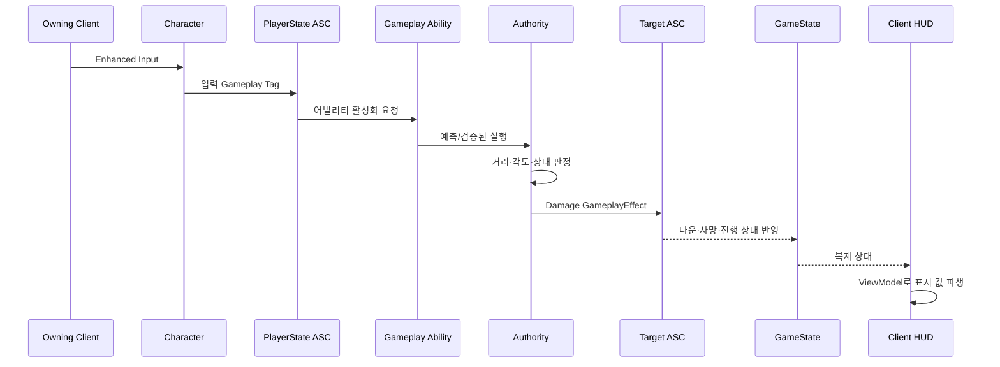
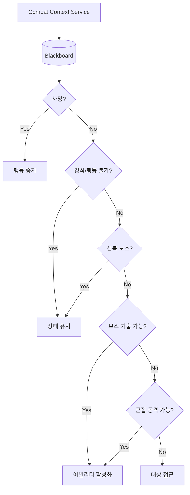
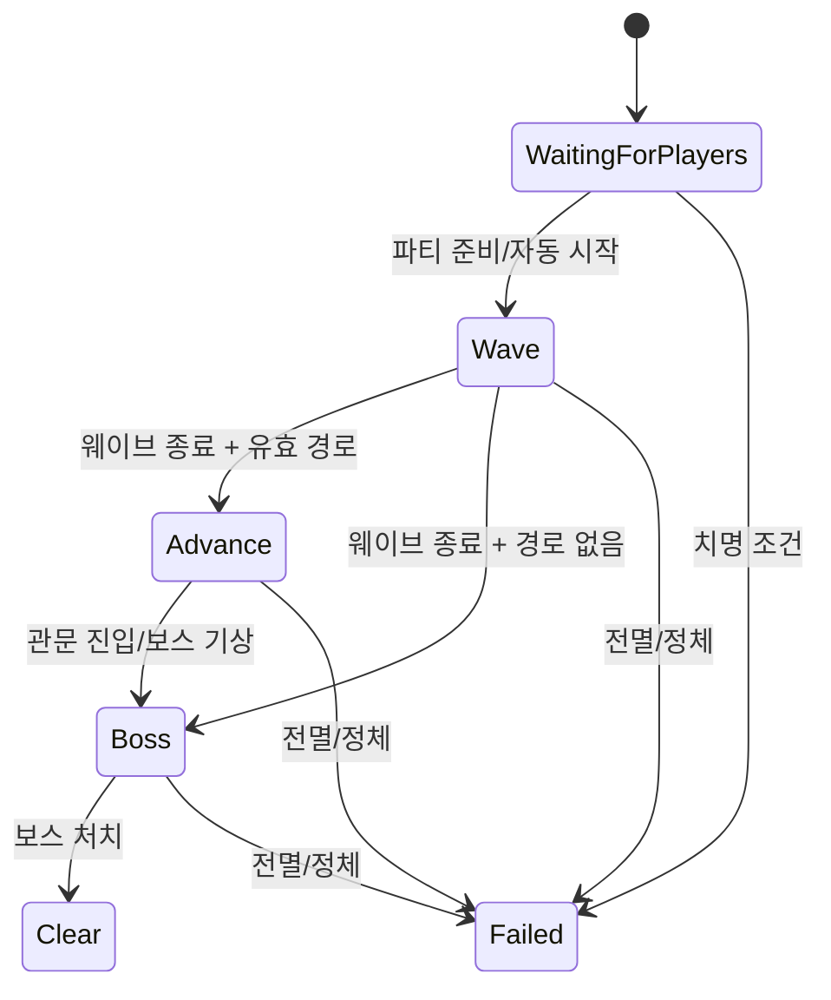

# 아키텍처

## 설계 목표

DediServerRPG의 런타임 구조는 다음 세 가지 경계를 우선합니다.

1. 게임 결과를 바꾸는 판정은 서버만 수행합니다.
2. 의사결정, 게임 규칙, 화면 표현을 서로 다른 계층에 둡니다.
3. Dedicated Server는 시각 자산을 로드하지 않습니다.

이 경계를 기준으로 GAS, Behavior Tree/Blackboard, AnimBP, 복제 UI의 역할을 나눴습니다.

## 런타임 책임

| 계층 | 주요 타입 | 책임 |
|---|---|---|
| 서버 매치 | `ADediServerRPGGameMode` | 로비, 페이즈 전이, 스폰, 보스 방/경로, 관문, 실패 판정 |
| 복제 상태 | `ADSTRGameState` | 페이즈, 목표, 파티 진행, 관문·보스, 최근 이벤트 복제 |
| 플레이어 상태 | `ADSTRPlayerState` | ASC·AttributeSet 소유, 준비 상태, 닉네임 |
| 플레이어 Pawn | `ADediServerRPGCharacter` | 입력, 이동, ASC 연결, 로컬 표현, 서버 요청 진입점 |
| 능력 시스템 | `UDSTRAbilitySystemComponent` | 시작 어빌리티, 입력 태그, 어빌리티 활성화 |
| 전투 규칙 | `UDSTRCombatLibrary`, `UDSTRDamageExecution` | 서버 권한 확인, 피해 GE 적용, 피해 계산 |
| 적 의사결정 | `ADSTRAIController`, BT, BB | 대상 선정, 전투 문맥, 행동 우선순위 |
| 적 실행 규칙 | BT Service/Task, `DSTREnemyAIRules` | 문맥 갱신, 이동, 공격 활성화, 수치 판정 |
| 클라이언트 표현 | `FDSTRCombatPresentation`, `UDSTRVisualAssetSubsystem` | 액션 프로필, 비동기 프리로드, 메시·AnimBP·몽타주 적용 |
| UI | `ADSTRHUD`, ViewModel, Widget | 복제 상태를 화면 모델과 위젯으로 변환 |

## 권한과 데이터 흐름



클라이언트는 조작과 예측 표현을 시작할 수 있지만 체력, 버프, 다운, 스폰 수, 매치 페이즈를 직접 확정하지 않습니다.

## 플레이어 ASC 수명

ASC와 AttributeSet은 Pawn이 아니라 `ADSTRPlayerState`에 있습니다. Pawn 교체와 능력 수명을 분리하기 위한 구성입니다.

- 서버는 `PossessedBy`에서 `InitAbilityActorInfo(PlayerState, Character)`를 호출합니다.
- 클라이언트는 `OnRep_PlayerState`에서 같은 연결을 복구합니다.
- 시작 어빌리티와 초기 GameplayEffect는 서버에서 한 번만 부여합니다.
- 클라이언트는 복제된 스펙, 속성, 태그를 사용합니다.

입력은 Enhanced Input Action을 직접 어빌리티 클래스에 묶지 않고 Gameplay Tag로 ASC에 전달합니다. 입력 장치와 능력 정의가 서로 독립적이며, E2E 드라이버도 같은 입력 태그 경로를 사용합니다.

## 서버 권한 전투

피해 적용의 단일 진입점은 `UDSTRCombatLibrary::ApplyDamage`입니다.

1. Source/Target ASC와 대상 상태를 검사합니다.
2. Source Avatar가 Authority인지 확인합니다.
3. 잠복 보스 면역과 유효 피해량을 검사합니다.
4. `UDSTRDamageEffect` Spec에 배율을 SetByCaller로 기록합니다.
5. Target ASC에 GameplayEffect를 적용합니다.
6. `UDSTRDamageExecution`과 AttributeSet이 최종 체력 변화를 처리합니다.

공격 범위와 각도는 공통 전투 수학/히트 쿼리에서 계산합니다. 피격 이펙트와 사운드는 `ApplyDamage`가 성공한 뒤에만 요청해, 공격 시도와 서버 확정 타격을 구분합니다.

## 다운과 부활

- 체력이 0이 되면 서버가 다운 상태와 45초 만료 시각을 설정합니다.
- HUD는 남은 시간을 매초 복제하지 않고 서버 시각과 만료 시각의 차이로 계산합니다.
- 부활 요청은 서버가 시전자/대상 상태, 탈락 여부, 거리와 동일 대상 여부를 다시 검사합니다.
- 성공 시 체력을 복구하고 2.5초 동안 `State.Invulnerable` 태그를 주는 GameplayEffect를 적용합니다.
- 만료된 플레이어는 탈락 처리하며 살아 있는 파티원이 없으면 매치를 실패시킵니다.

## 적 AI: BT/BB와 C++의 경계

적 AI는 서버에서만 실행합니다. Behavior Tree는 우선순위를, Blackboard는 현재 전투 문맥을 소유합니다.



- Blackboard: 대상, 거리, 공격 가능 여부, 잠복·경직 상태 등 런타임 값
- Behavior Tree: 사망 → 행동 불가 → 잠복 → 보스 기술 → 근접 공격 → 접근 순서
- Service: 전투 문맥을 일정 주기로 갱신
- Task: 접근, 공격 활성화, 상태 유지처럼 한 가지 작업 수행
- C++ Rules: 위협도, 대상 유지 히스테리시스, 기술 선택과 거리 계산

BT/BB 에셋은 프로젝트 소유 에디터 C++ 작성 도구로 생성·검증합니다. 런타임 C++에 거대한 상태 분기문을 중복하지 않고, 에디터에서 의사결정 흐름을 읽을 수 있게 한 구성입니다.

## 매치 상태 머신



`GameMode`가 상태를 바꾸고 `GameState`가 화면에 필요한 결과만 복제합니다. HUD 전용 RPC를 따로 두지 않아 늦게 접속한 클라이언트도 현재 복제 상태에서 화면을 재구성할 수 있습니다.

## 애니메이션과 전투 액션 복제

Dedicated Server는 애니메이션 자산을 로드하지 않습니다. 서버가 몽타주 인스턴스를 직접 소유하는 대신 다음의 작은 상태를 복제합니다.

```cpp
struct FDSTRReplicatedCombatAction
{
    EDSTRCombatAction Action;
    uint16 Sequence;
    uint8 Variant;
};
```

- `Action`: 재생해야 할 동작
- `Sequence`: 같은 동작이 연속 발생해도 복제 변경을 보장하는 번호
- `Variant`: 콤보/변형 몽타주 선택

소유 클라이언트는 입력 직후 표현을 예측하고, 서버 상태가 같은 액션·변형으로 회복 시간 안에 도착하면 중복 재생을 억제합니다. 원격 클라이언트는 RepNotify에서 재생합니다.

### AnimBP

Greystone과 Sevarog용 프로젝트 AnimBP는 로코모션 결과와 최종 포즈 사이에 `FullBody` 슬롯을 둡니다.

`Locomotion Pose → FullBody Slot → Output Pose`

전투 몽타주는 이 슬롯을 사용하므로 이동 상태 머신을 유지하면서 전신 공격 포즈를 합성할 수 있습니다. Python으로는 필요한 AnimGraph 노드/핀 조작 바인딩이 충분하지 않아, `UDSTRAnimationAuthoringLibrary::AddFullBodySlot`이 다음 과정을 수행합니다.

1. 최종 포즈의 기존 입력을 찾습니다.
2. `UAnimGraphNode_Slot`을 생성합니다.
3. 기존 포즈 → 슬롯 → 최종 포즈로 다시 연결합니다.
4. Blueprint를 구조 변경 처리한 뒤 컴파일·저장합니다.

런타임 애니메이션 로직은 AnimBP가 담당하고, C++ 함수는 반복 가능한 에셋 제작에만 사용합니다.

## 표현 자산 수명

`UDSTRVisualAssetSubsystem`과 `FDSTRVisualAssetRegistry`가 메시, AnimBP, 몽타주, FX, SFX의 Soft Object Path를 모아 클라이언트에서 비동기로 프리로드합니다.

- Dedicated Server: 로드 생략
- Listen/Standalone/Client: 프리로드 후 캐릭터 비주얼 적용
- 복제 액션이 로드보다 먼저 도착: 비주얼 적용 직후 현재 액션 재생
- 지속형 상태 표현: Gameplay Cue 또는 RepNotify
- 손실돼도 규칙에 영향이 없는 일회성 피드백: unreliable multicast

서버 판정 시각은 AnimNotify에 의존하지 않고 공유 액션 프로필의 측정값을 사용합니다. AnimNotify는 클라이언트 표현 이벤트를 맞추는 용도입니다.

## UI와 복제 상태

HUD는 `GameState`와 `PlayerState`를 읽는 ViewModel을 거쳐 표시 값을 만듭니다.

- 로비 인원/준비 상태
- 현재 페이즈와 목표
- 파티 체력·다운 상태·부활 만료
- 보스 체력과 관문 위치
- 쿨다운, 이벤트 피드, 월드 마커, 미니맵

미니맵은 클라이언트 전용 캡처 액터가 `DSTR_MinimapFloor` 태그를 가진 바닥을 한 번 수집해 구성합니다. 이름이나 메시 경로를 추측하는 런타임 폴백은 두지 않습니다.

## 레벨 계약

런타임이 레벨 액터를 찾는 기준은 명시적 태그입니다.

| 역할 | 액터 태그 |
|---|---|
| 스폰 문 | `DSTR_SpawnDoor` |
| 미니맵 바닥 | `DSTR_MinimapFloor` |
| BSP 대체 슬래브 | `DSTR_BspReplacement` |
| 바닥 보강 | `DSTR_FloorGapTile` |
| 벽 보강 | `DSTR_WallPatch` |

관문 배리어는 닫힌 동안 충돌, 내비 관련성, `bDynamicObstacle`, `NavArea_Null`을 함께 활성화하고 열릴 때 함께 해제합니다.

출시 맵의 저장된 Recast NavMesh는 현재 스폰 문 10개 중 2개만 조우 원점까지 완전 경로를 가집니다. 런타임은 이 사실을 감지해 유효한 문만 사용하지만, 근본 해결은 레벨 구조와 충돌을 함께 수정하는 작업입니다.

## 확장 원칙

- 새 규칙은 Authority 함수에서 시작하고 복제 결과만 클라이언트에 노출합니다.
- 새 상태는 가능한 한 GameplayEffect/Gameplay Tag 또는 `GameState`로 표현합니다.
- 새 AI 판단 값은 Blackboard에, 흐름은 BT에, 계산은 작은 C++ 규칙 함수에 둡니다.
- 새 전투 몽타주는 액션 프로필과 슬롯 계약을 먼저 추가합니다.
- 새 화면 값은 Widget이 월드를 직접 탐색하지 않고 ViewModel 입력으로 전달합니다.
- 자산 이름 추측이나 Tick 기반 전체 액터 검색 대신 명시적 태그와 레지스트리를 사용합니다.
