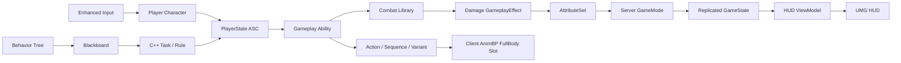

# DediServerRPG

Unreal Engine 5.4와 C++로 만든 1~4인 3인칭 협동 RPG 포트폴리오입니다. 전용 서버 권한, Gameplay Ability System(GAS), Behavior Tree/Blackboard, 복제 UI를 한 판의 흐름으로 연결하는 데 초점을 맞췄습니다.

> 이 저장소는 코드 검토용 공개본입니다. 상용 에셋의 재배포를 피하기 위해 `Content`, `Config`, 프로젝트 파일과 제작 스크립트는 포함하지 않으며, 저장소만으로 게임을 실행할 수는 없습니다.

## 프로젝트 요약

| 항목 | 내용 |
|---|---|
| 엔진 | Unreal Engine 5.4 |
| 개발 | C++, GAS, Enhanced Input, UMG |
| 네트워크 | Dedicated Server, 최대 4인, 서버 권한 판정 |
| 게임 흐름 | 접속 → 로비 → 웨이브 → 전진/관문 → 보스 → 결과 |
| 전투 | 플레이어 전투 기술 5종 + 부활, 보스 기술 4종 |
| AI | 서버 전용 Behavior Tree + Blackboard |
| 공개 코드 | `Source` 내 C++/Target/Build 파일 149개 |
| 로컬 자산 | 전투 몽타주 41개, FullBody 슬롯 AnimBP 2개 |

## 핵심 구현

- 데미지, 상태 변화, 스폰, 부활, 버프 소비, 매치 전이는 서버에서만 확정합니다.
- 플레이어의 ASC와 AttributeSet은 `PlayerState`가 소유해 Pawn 재생성과 능력 수명을 분리했습니다.
- 적의 의사결정과 런타임 상태는 Behavior Tree/Blackboard가 담당하고, 판정 규칙과 원자적 동작만 C++로 구성했습니다.
- Dedicated Server는 메시·애니메이션·FX·SFX를 로드하지 않습니다. 클라이언트 표현 자산은 비동기 프리로드합니다.
- 지속 상태는 GameplayEffect/Gameplay Cue 또는 RepNotify로 전달하고, 일회성 타격 피드백만 unreliable multicast로 분리했습니다.
- `GameState`의 복제 상태를 HUD ViewModel이 읽도록 해 게임 규칙과 화면 구성을 분리했습니다.
- 4개 클라이언트 프로세스가 실제 입력 태그와 컨트롤 회전을 사용하는 E2E 드라이버로 전체 매치 흐름을 반복 검증했습니다.

## 전체 구조

매치 상태는 서버에서 다음과 같이 전이합니다.

`WaitingForPlayers → Wave → Advance → Boss → Clear`

전멸이나 장시간 무진척 상태에서는 `Failed`로 전이합니다. 유효한 전진 경로가 없는 맵 상태에서는 웨이브 종료 후 보스로 바로 넘어가는 안전 경로도 둡니다.

자세한 책임과 데이터 흐름은 [아키텍처 문서](Docs/Portfolio/ARCHITECTURE.md)에 정리했습니다.

## 정석적인 역할 분리

### GAS

입력 태그, 쿨다운, 비용, GameplayEffect, 속성, 상태 태그와 서버 판정을 담당합니다. 클라이언트가 체력이나 상태를 직접 쓰는 경로는 없습니다.

### Behavior Tree / Blackboard

대상, 공격 가능 여부, 보스 기술 선택, 잠복·경직 상태처럼 의사결정에 필요한 값을 Blackboard에 두고, Behavior Tree가 우선순위를 표현합니다. C++ 태스크는 이동이나 어빌리티 활성화처럼 한 가지 동작만 수행합니다.

### AnimBP / 몽타주

AnimBP는 로코모션 최종 포즈 앞에 `FullBody` 슬롯을 두고 전투 몽타주를 합성합니다. 에디터 Python 바인딩으로 안전하게 수정할 수 없던 AnimGraph 연결은 프로젝트 소유 C++ 에디터 함수가 생성·컴파일·저장하도록 구현했습니다.

몽타주 재생 자체는 GAS로 옮기지 않았습니다. 애니메이션을 로드하지 않는 Dedicated Server 경계와 충돌하기 때문에 서버는 `Action / Sequence / Variant`만 복제하고 클라이언트가 대응 몽타주를 재생합니다.

## 조작

| 입력 | 동작 |
|---|---|
| WASD | 이동 |
| 마우스 | 시점/조준 |
| Space | 점프 |
| LMB | 기본 공격 3연격 |
| RMB | Make Way |
| Q | Fortify |
| E | Assault the Gates |
| R | Reckoning |
| F | 부활/버프 상호작용 |

## 코드 탐색

| 영역 | 시작점 |
|---|---|
| 매치 흐름 | [`DediServerRPGGameMode.cpp`](Source/DediServerRPG/DediServerRPGGameMode.cpp), [`DSTRGameState.cpp`](Source/DediServerRPG/Private/Game/DSTRGameState.cpp) |
| GAS 수명/입력 | [`DSTRPlayerState.cpp`](Source/DediServerRPG/Private/Player/DSTRPlayerState.cpp), [`DSTRAbilitySystemComponent.cpp`](Source/DediServerRPG/Private/AbilitySystem/DSTRAbilitySystemComponent.cpp) |
| 서버 전투 판정 | [`DSTRCombatLibrary.cpp`](Source/DediServerRPG/Private/Combat/DSTRCombatLibrary.cpp), [`DSTRDamageExecution.cpp`](Source/DediServerRPG/Private/AbilitySystem/DSTRDamageExecution.cpp) |
| 플레이어 어빌리티 | [`Abilities`](Source/DediServerRPG/Private/AbilitySystem/Abilities) |
| 적 AI | [`DSTRAIController.cpp`](Source/DediServerRPG/Private/Enemy/DSTRAIController.cpp), [`AI`](Source/DediServerRPG/Private/Enemy/AI) |
| 애니메이션/표현 | [`Presentation`](Source/DediServerRPG/Private/Presentation), [`DSTRCombatPresentation.cpp`](Source/DediServerRPG/Private/Presentation/DSTRCombatPresentation.cpp) |
| HUD/ViewModel | [`UI`](Source/DediServerRPG/Private/UI) |
| 동적 관문 | [`DSTRBossGate.cpp`](Source/DediServerRPG/Private/World/DSTRBossGate.cpp) |

## 대표 네트워크 트러블슈팅

| 문제 | 원인 | 적용한 해결 |
|---|---|---|
| 예측 클라이언트에서도 타격 타이머 실행 | 표현 재생과 권한 판정이 섞임 | 타격 예약은 Authority에서만 수행 |
| 클라이언트에서 ASC 초기화 시점 불일치 | Pawn과 PlayerState의 복제 순서가 다름 | ASC는 PlayerState가 소유하고 `PossessedBy`/`OnRep_PlayerState` 양쪽에서 연결 |
| 빠른 연속 액션이 누락되거나 중복 재생 | 순간 RPC만으로 상태 복구 불가 | `Action / Sequence / Variant` RepNotify + 로컬 예측 정합 |
| 막힌 공격에도 타격 효과 출력 | 시도와 확정 결과를 구분하지 않음 | `ApplyDamage == true` 이후에만 피드백 재생 |
| 오래된 부활 요청이 적용될 위험 | 클라이언트 상태와 서버 상태가 달라질 수 있음 | 서버가 대상·다운·탈락·거리 조건을 다시 검사 |
| 카운트다운 값의 드리프트와 반복 복제 | 남은 초를 상태처럼 전송 | 종료 서버 시각만 복제하고 각 클라이언트가 계산 |
| 접속 직후 준비 상태가 너무 일찍 확정 | PlayerState와 비주얼 준비가 비동기 | 두 조건 완료 후 Server RPC, 서버가 전원 준비를 재검사 |
| 스폰 직후 적의 첫 액션이 보이지 않음 | RepNotify가 비동기 비주얼보다 먼저 도착 | 비주얼 적용 직후 활성 복제 액션 재생 |

재현 조건과 선택 근거는 [트러블슈팅 문서](Docs/Portfolio/TROUBLESHOOTING.md)에 자세히 기록했습니다.

## 최근 검증 결과

- `DediServerRPGEditor Win64 Development`: 빌드 성공
- `DediServerRPG Win64 DebugGame`: 빌드 성공
- 4프로세스 E2E: 서버 Clear, 클라이언트 4개 모두 Clear
- 부활: 트리거 및 성공 확인
- 관문: 진입 1회, 우회 0회, 보스 기상 1회
- 전투: 적 12명 처치, 일반 적 근접 타격 75회
- 맵 검사: Static Mesh 751, PlayerStart 4, Nav Bounds 1, 스폰 문 10
- 최종 로그: 프로젝트 자산 누락, AI 런타임 실패, 크래시 신호 각 0건

수치의 원문과 검증 범위는 [검증 문서](Docs/Portfolio/VERIFICATION.md)에서 확인할 수 있습니다.

## 확인된 한계

- 사람 4인 파티 검증은 아직 0회입니다. 현재 매치 수치는 봇 기반이며, 출혈 만료와 HUD 카운트다운은 실제 화면으로 수동 확인하지 못했습니다.
- 일회성 타격 연출 13종은 unreliable multicast를 유지합니다. 유실돼도 게임 상태에 영향을 주지 않는 시각·청각 피드백으로 한정했습니다.
- 접속은 OnlineSubsystem 세션 검색이 아닌 IP:포트 직접 접속 방식입니다.
- Epic Launcher 배포 엔진에서는 독립 `Server` 타깃을 만들 수 없어 Editor의 `-server -nullrhi`로 E2E를 수행했습니다. 독립 서버 패키징에는 소스 빌드 엔진이 필요합니다.
- 출시 맵의 NavMesh는 스폰 문 10개 중 2개만 완전 경로를 가지며, 이 문제는 레벨 아트 작업으로 분리했습니다.

## 공개 범위

이 저장소에는 다음 항목만 포함합니다.

- 전체 `Source`
- 공개용 아키텍처·트러블슈팅·검증 문서
- 저장소 설정 파일

상용/Fab 자산, 맵, 로컬 경로가 포함된 제작 메모, 자동화 실행 스크립트, 빌드 결과물과 분리된 레거시 테스트 파일은 공개 대상에서 제외했습니다. 명령줄 옵션으로만 붙고 Shipping에서는 비활성화되는 최소 E2E 드라이버와 캡처 훅은 검토 가능한 런타임 소스로 남겼습니다.

추가 설계 배경과 제작 기록은 [Notion 포트폴리오](https://cookie-roquefort-35d.notion.site/DediServerRPG-Dedicated-Server-GAS-RPG-3c76907ae0ce804bb8f6d9810b51b395)에 정리되어 있습니다.
