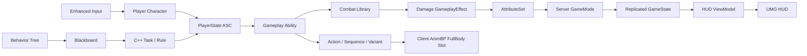

# DediServerRPG

Unreal Engine 5.4와 C++로 만든 1~4인 3인칭 협동 RPG 포트폴리오입니다. 전용 서버 권한, Gameplay Ability System(GAS), Behavior Tree/Blackboard, 복제 UI를 한 판의 흐름으로 연결하는 데 초점을 맞췄습니다.

> 이 저장소는 코드 검토용 공개본입니다. 상용 에셋의 재배포를 피하기 위해 `Content`, `Config`, 프로젝트 파일과 제작 스크립트는 포함하지 않으며, 저장소만으로 게임을 실행할 수는 없습니다.

## 프로젝트 요약

| 항목 | 내용 |
|---|---|
| 엔진 | Unreal Engine 5.4 |
| 개발 | C++, GAS, Enhanced Input, UMG |
| 네트워크 | Dedicated Server, 최대 4인, 서버 권한 판정 |
| 게임 흐름 | 접속 → 로비 → 웨이브 → 전진/관문 → 보스 → 결과 |
| 전투 | 플레이어 전투 기술 5종 + 부활, 보스 기술 4종 |
| AI | 서버 전용 Behavior Tree + Blackboard |

## 핵심 구현

- 데미지, 상태 변화, 스폰, 부활, 버프 소비, 매치 전이는 서버에서만 확정합니다.
- 플레이어의 ASC와 AttributeSet은 `PlayerState`가 소유해 Pawn 재생성과 능력 수명을 분리했습니다.
- 적의 의사결정과 런타임 상태는 Behavior Tree/Blackboard가 담당하고, 판정 규칙과 원자적 동작만 C++로 구성했습니다.
- Dedicated Server는 메시·애니메이션·FX·SFX를 로드하지 않습니다. 클라이언트 표현 자산은 비동기 프리로드합니다.
- 지속 상태는 GameplayEffect/Gameplay Cue 또는 RepNotify로 전달하고, 일회성 타격 피드백만 unreliable multicast로 분리했습니다.
- `GameState`의 복제 상태를 HUD ViewModel이 읽도록 해 게임 규칙과 화면 구성을 분리했습니다.
- 4개 클라이언트 프로세스가 실제 입력 태그와 컨트롤 회전을 사용하는 E2E 드라이버로 전체 매치 흐름을 반복 검증했습니다.

## 전체 구조

매치 상태는 서버에서 다음과 같이 전이합니다.

`WaitingForPlayers → Wave → Advance → Boss → Clear`

전멸이나 장시간 무진척 상태에서는 `Failed`로 전이합니다.

자세한 책임과 데이터 흐름은 [아키텍처 문서](Docs/Portfolio/ARCHITECTURE.md)에 정리했습니다.

## 구현 역할 분리

### GAS

입력 태그, 쿨다운, 비용, GameplayEffect, 속성, 상태 태그와 서버 판정을 담당합니다. 클라이언트가 체력이나 상태를 직접 쓰는 경로는 없습니다.

### Behavior Tree / Blackboard

대상, 공격 가능 여부, 보스 기술 선택, 잠복·경직 상태처럼 의사결정에 필요한 값을 Blackboard에 두고, Behavior Tree가 우선순위를 표현합니다. C++ 태스크는 이동이나 어빌리티 활성화처럼 한 가지 동작만 수행합니다.

### AnimBP / 몽타주

AnimBP는 로코모션 최종 포즈 앞에 `FullBody` 슬롯을 두고 전투 몽타주를 합성합니다. 에디터 Python 바인딩으로 안전하게 수정할 수 없던 AnimGraph 연결은 프로젝트 소유 C++ 에디터 함수가 생성·컴파일·저장하도록 구현했습니다.

몽타주 재생 자체는 GAS로 옮기지 않았습니다. 애니메이션을 로드하지 않는 Dedicated Server 경계와 충돌하기 때문에 서버는 `Action / Sequence / Variant`만 복제하고 클라이언트가 대응 몽타주를 재생합니다.

## 코드 탐색

| 영역 | 시작점 |
|---|---|
| 매치 흐름 | [`DediServerRPGGameMode.cpp`](Source/DediServerRPG/DediServerRPGGameMode.cpp), [`DSTRGameState.cpp`](Source/DediServerRPG/Private/Game/DSTRGameState.cpp) |
| GAS 수명/입력 | [`DSTRPlayerState.cpp`](Source/DediServerRPG/Private/Player/DSTRPlayerState.cpp), [`DSTRAbilitySystemComponent.cpp`](Source/DediServerRPG/Private/AbilitySystem/DSTRAbilitySystemComponent.cpp) |
| 서버 전투 판정 | [`DSTRCombatLibrary.cpp`](Source/DediServerRPG/Private/Combat/DSTRCombatLibrary.cpp), [`DSTRDamageExecution.cpp`](Source/DediServerRPG/Private/AbilitySystem/DSTRDamageExecution.cpp) |
| 플레이어 어빌리티 | [`Abilities`](Source/DediServerRPG/Private/AbilitySystem/Abilities) |
| 적 AI | [`DSTRAIController.cpp`](Source/DediServerRPG/Private/Enemy/DSTRAIController.cpp), [`AI`](Source/DediServerRPG/Private/Enemy/AI) |
| 애니메이션/표현 | [`Presentation`](Source/DediServerRPG/Private/Presentation), [`DSTRCombatPresentation.cpp`](Source/DediServerRPG/Private/Presentation/DSTRCombatPresentation.cpp) |
| HUD/ViewModel | [`UI`](Source/DediServerRPG/Private/UI) |

## 대표 네트워크 트러블슈팅

### 1. 로컬 예측과 서버 판정 분리

`LocalPredicted` GAS 어빌리티는 소유 클라이언트와 서버에서 모두 활성화됩니다. 클라이언트는 입력 반응과 몽타주만 예측하고, 타격 타이머는 Authority에서만 예약하도록 분리했습니다. 피해 진입점도 Source Avatar의 Authority를 다시 검사해 체력 변경 경계를 한 곳으로 고정했습니다.

### 2. Pawn과 PlayerState의 ASC 수명 불일치

클라이언트에서 Pawn과 PlayerState의 도착 순서는 일정하지 않습니다. ASC와 AttributeSet은 PlayerState가 소유하고 서버의 `PossessedBy`, 클라이언트의 `OnRep_PlayerState`에서 현재 Pawn을 Avatar로 연결합니다. 두 초기화 경로가 겹쳐도 시작 능력과 델리게이트가 중복되지 않도록 가드를 뒀습니다.

### 3. 순간 RPC로 복구할 수 없는 전투 액션

Multicast만으로 공격을 알리면 늦게 관련성을 얻은 클라이언트가 현재 동작을 복구할 수 없습니다. 서버는 `Action / Sequence / Variant`를 RepNotify로 보내고, `Sequence`로 같은 액션의 연속 발생도 구분합니다. 소유 클라이언트는 서버 확인과 로컬 예측을 정합하고, 게임 상태와 무관한 일회성 FX·SFX만 unreliable multicast로 남겼습니다.

### 4. 네트워크 상태와 클라이언트 준비 순서

접속 완료가 PlayerState 복제와 비주얼 프리로드 완료를 의미하지는 않습니다. 클라이언트는 두 조건을 모두 만족한 뒤 준비를 보고하고, 서버는 전원 준비 상태를 확인한 뒤 매치를 시작합니다. 전투 액션이 AnimBP보다 먼저 도착한 경우에도 비주얼 적용 직후 현재 복제 액션을 다시 재생해 도착 순서에 의존하지 않게 했습니다.

재현 조건과 선택 근거는 [트러블슈팅 문서](Docs/Portfolio/TROUBLESHOOTING.md)에 자세히 기록했습니다.

## 저장소 범위

전체 `Source`와 공개 기술 문서만 포함합니다. 상용/Fab 자산, 맵, 제작 스크립트와 빌드 결과물은 제외했습니다.

추가 설계 배경과 제작 기록은 [Notion 포트폴리오](https://cookie-roquefort-35d.notion.site/DediServerRPG-Dedicated-Server-GAS-RPG-3c76907ae0ce804bb8f6d9810b51b395)에 정리되어 있습니다.
